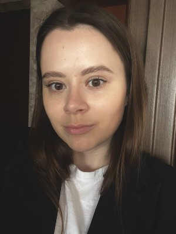

# Ann Kalodzinskaya 

## Contacts

* **Mobile phone:** +375 (33) 6614821

* **Email:** anyabukato@gmail.com

* **Telegram:** @anyabukatik

* **GitHub:** @bukatik

## Skills

* **HTML (base)**

* **CSS (base)**

## Experience

* **CV project**

## Education

* **2015-2020**

Minsk State Linguistic University

Modern foreign languages

Graduated as a Linguist, a Teacher of two foreign languages (English, Spanish)

## Career

* **2023-now** Private English tutor
* **2021-2023** Language school, position: co-owner, teacher
* **2020-2021** Language school, position: teacher

## Languages

* **Russian** - native
* **Belarussian** - native
* **English** - upper-intermediate/ advanced
* **Spanish** - elementary